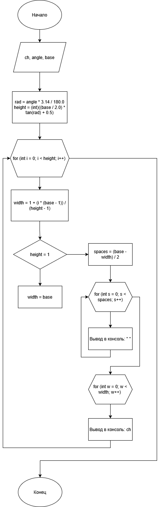

# Домашнее задание к работе 2

## Условие задачи
Написать программу, выводящую на экран заданную
геометрическую фигуру, нарисованную с помощью заданного с клавиатуры
символа, условие заполнения фигуры и задаваемые параметры фигуры в
таблице (остальные можно взять константные)
## 1. Алгоритм и блок-схема

### Алгоритм
1. **Начало**
2. Объявить переменные для сохранения введенных пользователем данных:
   - `ch` = 4 (л/день) — ежедневный объем покупки.
   - `angle` = 31 — количество дней в марте.
   - `base` = 30 — количество дней в апреле.
4. Вычислить угол в радианах для использования его в функции tan():
   - `double rad` = `angle` * `3.14` / `180.0`
5. Вычислить высоту треугольника:
   - `int height` = (int)((`base` / `2.0`) * `tan(rad)` + `0.5`);
6. Создать управляющую конструкцию первего цикла for для прохождения по строкам:
   - `for` (`int i = 0`; `i < height`; `i++`) 
7. Рассчиать линейную интерполяцию относительно текущей строки для того, чтобы знать приращивание:
   - `int width` = `1` + (`i` * (`base` - `1`)) / (`height` - `1`);
8. Создать условный оператор на проверку знаменателя формулы линейной интерполяции:
   - `if (height == 1) width = base;`
9. Вычислить отступ от начала строки:
   - `int spaces = (base - width) / 2;`
10. В двух циклах выполнить простановку отступов и элементов треугольника:
   - `for (int s = 0; s < spaces; s++)`
            `printf(" ");`
   - `for (int w = 0; w < width; w++) `
            `printf("%c", ch);`
10. **Конец**

### Блок-схема
 

## 2. Реализация программы

```C
#include <stdio.h>
#include <math.h>
#include <locale.h>

int main() 
{
    setlocale(LC_ALL, "RUS");
    char ch;
    double angle;
    int base;

    printf("Введите символ: ");
    scanf(" %c", &ch);

    printf("Введите угол a (в градусах, 1–89): ");
    scanf("%lf", &angle);

    printf("Введите длину основания: ");
    scanf("%d", &base);
    printf("\n");

    double rad = angle * 3.14 / 180.0;
    int height = (int)((base / 2.0) * tan(rad) + 0.5);

    for (int i = 0; i < height; i++) 
    {
        int width = 1 + (i * (base - 1)) / (height - 1);
        if (height == 1) width = base;

        int spaces = (base - width) / 2;

        for (int s = 0; s < spaces; s++)
            printf(" ");
        for (int w = 0; w < width; w++) 
            printf("%c", ch);
        printf("\n");
    }

    system("pause");

    return 0;
}
```

## 3. Результаты работы программы

```
Enter symbol: #
Enter angle a (1-89 degrees): 45
Enter base length: 15

       #
      ###
     #####
   ########
  ##########
 ############
###############
Для продолжения нажмите любую клавишу . . .

C:\Programs\VS\VSProjects\Homework\HM_9\x64\Debug\HM_9.exe (процесс 14464) завершил работу с кодом 0 (0x0).
Нажмите любую клавишу, чтобы закрыть это окно:
```
## 4. Информация о разработчике
Григорян Эмиль бТИИ-251
